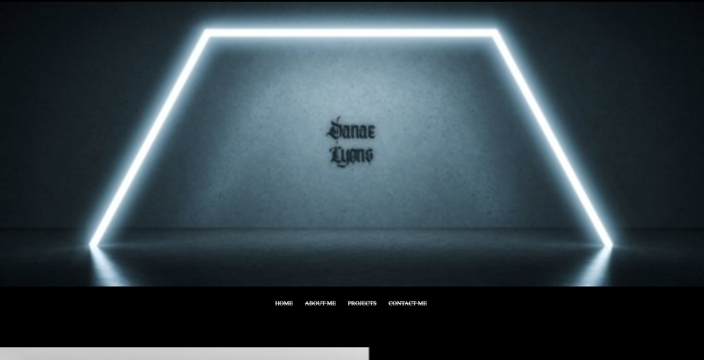

# DanaesPortfolio
# description
This is my first draft of my portfolio.
I will be adding my future projects here as time goes on and they're completed.
I have a button to contact me and have written a little bit about myself.
# Preview

Added images into a folder within my Website portfolio folder.
Used HTML to source those files for display.
Used HTML to create containers for About Me, Contact Me, Projects and Home.
Wrote text within HTML and Styled with flexbox, font family's, padding, and alignment using CSS.
